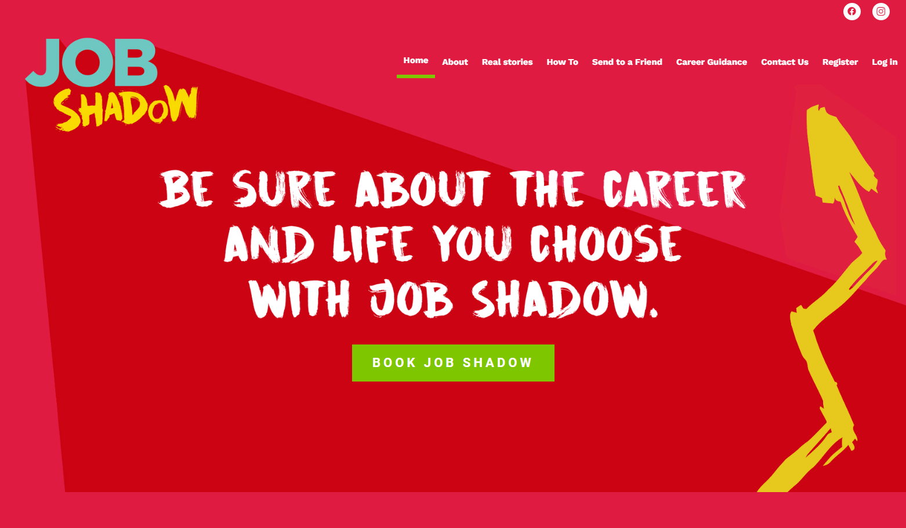

# Job Shadow

Job Shadow is a website that provides information about different jobs and careers in South Africa, as well as advice on job searching and career development. It was built with Laravel.





## Installation

1. Clone the repository: `git clone https://github.com/your-username/jshadow.git`
2. Navigate into the project directory: `cd jshadow`
3. Install composer dependencies: `composer install`
4. Copy .env.example file to .env file: `cp .env.example .env`
5. Generate application key: `php artisan key:generate`
6. Create a MySQL database and update `.env` file with your database credentials
7. Run database migrations: `php artisan migrate`


## Usage

To start the server run:

```
php artisan serve
```

Then go to `http://localhost:8000` in your web browser.

## Contributing

If you'd like to contribute, please fork the repository and use a feature branch. Pull requests are welcome!

## License

The code in this project is licensed under MIT license. See [LICENSE](LICENSE) for details.
